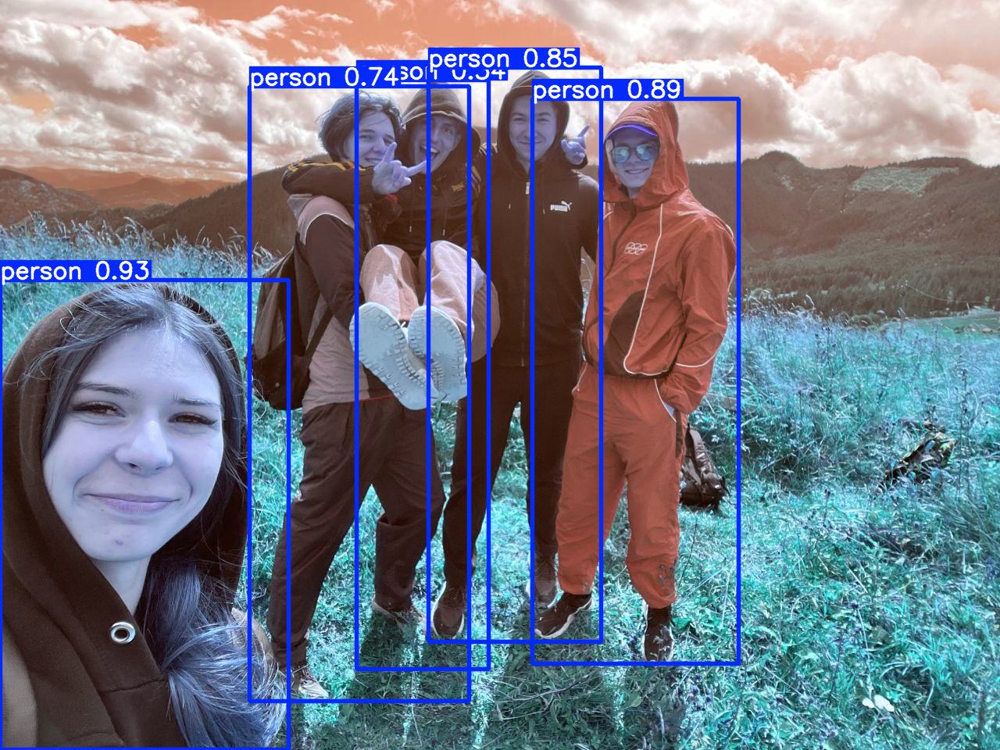

# Object Detection Web Application (YOLOv8 + FastAPI)

## Overview
This project is a web application built using **FastAPI** that utilizes a pre-trained **YOLOv8n** model from Ultralytics for object detection of images.  
It allows users to send images through an API and receive JSON with detected objects, as well as optionally an annotated image with bounding boxes overlaid on it.

---

## Main Components

### Architecture
The service is implemented as an API. List of the available endpoints:

- `/` — Index endpoint for health-check.  
- `/labels` — Returns all supported COCO classes (80 classes).  
- `/predict` — Accepts an uploaded image (JPG/PNG) and returns detected objects in JSON format. Can also return the annotated image in Base64 if requested.

### Object Detection Model
- Model: **YOLOv8n** (`yolov8n.pt`)  
- Pre-trained on **COCO dataset** (80 classes including people, cars, animals, household items, etc.)  
- Inference powered by the **Ultralytics** library on top of **PyTorch**  

### Technology Stack
- **FastAPI**: API creation and HTTP request handling.  
- **YOLOv8 (Ultralytics)**: Object detection model.  
- **Torch**: Backend for model inference.  
- **Pillow**: Image processing.  
- **Pydantic**: Input validation.  
- **Uvicorn**: ASGI server to run the FastAPI application.  
- **Poetry**: Dependency management.  

---

## How to Start

### 1. Install dependencies with Poetry
Navigate to the project folder:
```powershell
cd D:\Data-Science-Camp-Tasks\Home_Task_30
poetry install

###  2. Run the server
```powershell 
poetry run uvicorn app:app --reload --host 0.0.0.0 --port 8000

Expected logs:
```INFO:     Uvicorn running on http://0.0.0.0:8000
INFO:     Application startup complete.
[INFO] yolo_api: Model loaded successfully.

The API is now available at http://127.0.0.1:8000.

## API Requests

Once the server is running:

### Health check

GET http://127.0.0.1:8000/


### List of classes

GET http://127.0.0.1:8000/labels

### Prediction

POST http://127.0.0.1:8000/predict


**Form-data parameters:**
- `file=@image.jpg` — image file to analyze  
- `return_image=true` *(optional)* — include annotated image in Base64  

### Example JSON response
```json
{
  "detections": [
    {"cls_id": 0, "cls_name": "person", "confidence": 0.98, "bbox_xyxy": [50, 40, 85, 180]},
    {"cls_id": 2, "cls_name": "car", "confidence": 0.87, "bbox_xyxy": [120, 100, 250, 200]}
  ],
  "width": 1280,
  "height": 720,
  "annotated_image_base64": null
}

--- 

## Testing with Client

A sample Python client is provided in `client.py`.

Run:
```powershell
poetry run python client.py


## Example Output

Here is an example of the annotated image:

